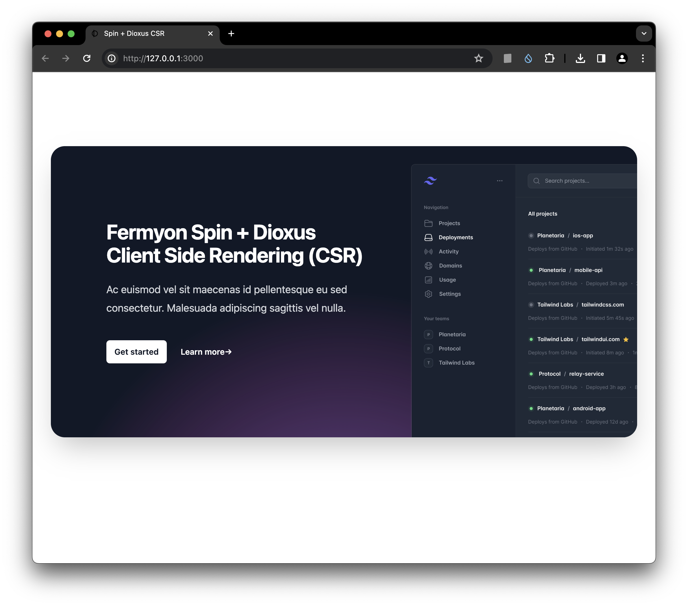

# spin-dioxus-csr
Fermyon Spin + Dioxus - Client Side Rendering (CSR) template with Tailwind



### Setup

Accomodate "chicken & egg" issue for https://github.com/DioxusLabs/collect-assets

```bash
mkdir pkg
touch pkg/tailwind.css
```

### Run

```bash
cargo build
npm install
spin build --up
```

### Requirements

#### Fermyon ⏀Spin

https://www.fermyon.com/spin

#### 🧬 Dioxus 0.5

https://dioxuslabs.com

#### Tailwind (npm)

Instructions used for this template: https://dioxuslabs.com/learn/0.5/cookbook/tailwind
